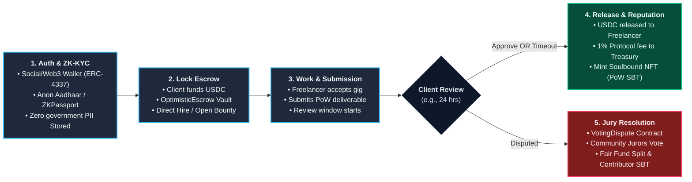

# Gigly — Technical Workflow Overview

> **Compact, single-slide workflow for presentation slides (Landscape).**

---

### Slide Bullet Points (Quick Speaker Notes)

1. **Auth & Zero-Knowledge KYC**: 
   - Instant onboarding via Google/Email (ERC-4337) or Web3 wallets.
   - Identities validated entirely on-device via **Anon Aadhaar** (India) & **ZKPassport** (Global) using ZK-SNARKs — zero personal data stored.

2. **Smart Escrow Lock**: 
   - Client locks Circle USDC directly into the `OptimisticEscrow` smart contract on Ethereum Sepolia.

3. **Deliverable & Dynamic Review Window**: 
   - Freelancer completes task and submits a verifiable proof-of-work link. Triggers a dynamic countdown timer.

4. **Optimistic Release & Soulbound Reputation**: 
   - Silence equals approval: if no dispute is raised, funds auto-release.
   - Mints a permanent, non-transferable **ERC-721 Soulbound Token (SBT)** as mathematical proof of successful delivery.

5. **Community Dispute Resolution**: 
   - If contested, routed to the `VotingDispute` contract where registered community jurors vote on-chain to decide payouts.
